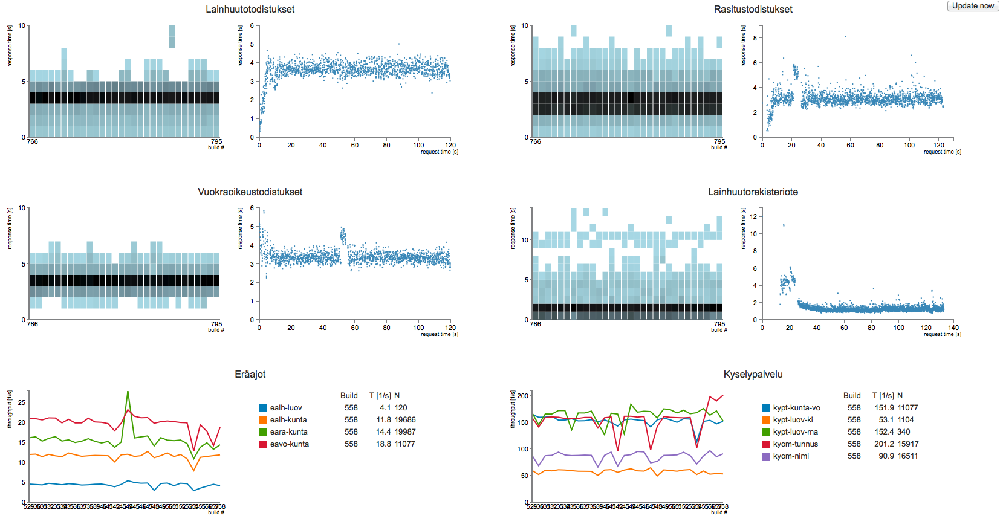

## What it is

Perfgraph is the visualizer for performance regression data of Jenkins JMeter tests.
Data is gathered by perfdata project. The data is stored in mongodb and visualized with d3.

Currently it is used in KIOS and the dataflow goes like this

`Jenkins (JMeter) -> server.coffee (process-builds) -> mongodb -> server.coffee (access data) -> browser (d3)`

This project is specialiced to current toolchain and has some hardcoded
parameters in it.

## Status

In production, heavily tailored data retrieval. Production special parsing of troughput data.
Classes under server package have to be tailored to specific data sources and format.

## Setting up the development environment
1. Install nvm, mongod and start mongod
```
curl https://raw.githubusercontent.com/creationix/nvm/v0.7.0/install.sh | sh
# restart shell to get nvm into environment
nvm install 0.8
brew install mongodb
# debian/ubuntu: apt-get install mongodb-10gen
```

2. Clone and start the application (without any data)
```
git clone https://github.com/solita/perfgraph.git
cd perfgraph
npm install
npm run build-client
npm run dev-start
open http://localhost:3000
```

## Mongodb

Uses localhost as mongodb host. Uses database "kios-perf". Default collections are hardcoded into
`server/[services,tietopalvelut,tulosteet].coffee` :).

## Other requirements

For meaningful data some performance measurements builds are needed. The code is tailored to get JMeter
logs from a Jenkins server job. Example implementation is used internally, so the default urls must be edited
under `server/[services,tietopalvelut,tulosteet].coffee`

## Who

sirkkalap - Petri Sirkkala, KIOS, Solita



